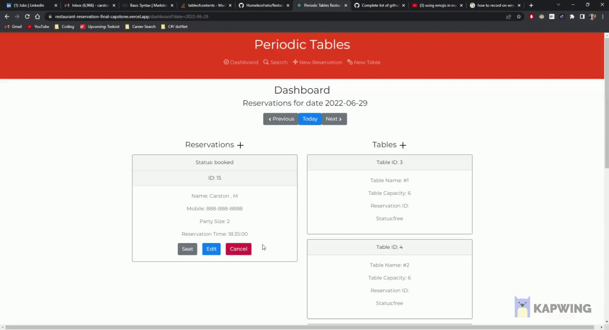

# Periodic Tables: Restaurant Reservation Application

:exclamation: [Active example](https://restaurant-reservation-final-capstone.vercel.app/dashboard) :exclamation:

## Table of contents
1. [Introduction](#introduction)
2. [Tech Stack](#techStack)
3. [Features](#features)
    - [Reservations](#reservations)
    - [Tables](#tables)
4. [Custom Database Setup](#databaseSetup)
5. [Local Installation Instructions](#installation)

## Introduction 
Periodic Tables is a restaurant reservation booking and table management system. Users of this application can view, create, edit, and delete reservations. Users can also search for reservations via mobile-number. Users can create new tables and seat reservations at a specific table. When seating the reservation at a table, validation will occur to ensure that the table size is of capable capacity for the reservation.

## Tech Stack 
Frontend
- React.js
- CSS
- Bootstrap 5

Backend
- Node.js
- PostgreSQL
- Express.js
- Knex.js
- CORS

Additional Tools Used
- Postman
- DBeaver
- Elephant SQL

## Features 
This is a sub paragraph, formatted in heading 3 style

## Reservation Features 
### Create Reservation

You can create a reservation one of two ways. First you can create a new reservation by clicking on the `+ New Reservation` at the top of the page, or by clicking the `+` next to the reservation listing header. Each reservation requires a first name, last name, mobile number, party size, reservation time, and reservation date.
> Errors will be thrown if one of the following were to occur: Invalid mobile number length, any of the fields are empty, date of reservation must be placed for the future, and the reservation time must be valid as well being between the restaurant hours.

### Edit Reservation

You can edit any of the reservations that have not been seated by clicking on the `Edit` button found at the bottom of each reservation card. Clicking the edit button will redirect the user to an edit reservation page which will allow the user to edit any of the customer information. 

### Seat Reservation

To seat a reservation, simply click on the `Seat` button, this will redirect the user to a new page where the user can view the reservation party size. It will also display to the user a dropdown table which will list all of the tables and the table's max seating. 

The table card will then be updated to show `Occupied` as well as the customers ID that is currently occupying the table. 

>If the party size is too big for the selected table, an error will notify the user that the selected table is too small.

### Cancel Reservation

User has the ability to cancel any reservation that has been created and yet to be seated. Clicking on the `Cancel` button at the bottom of each reservation card will generate a Windows Confirmation dialog box will appear asking the user to confirm the cancellation. 

### Search Reservation

At the top of the navbar is a link to a search bar. When user clicks on the link it will redirect them to the search bar where the user can input any mobile number and will lookup to see if that mobile number has been used for a reservation. It will also show the status of the mobile number as either `Seated`, `Booked`, `Cancelled`, or `Finished`.

## Table Features 

### Create a Table

User can click on either the `+` button next to the table listings or at the top of the page with the `+ New Table` button. Either button will redirect the user to the New Table page which allows the user to create a new table name and the seating capacity. 

### Finish a Table

Once a reservation has been served. Users can free tables of reservations by clicking the `Finish` button located at the bottom of the reservation card of an occupied table. After clicking the finish button, a windows confirmation pop-up message will appear asking the user to confirm the freeing of the table. 

## Database Setup <a name="databaseSetup">

1. Set up four new ElephantSQL database instances - development, test, preview, and production - by following the instructions in this [article](https://medium.com/@noogetz/how-to-setup-a-database-with-elephantsql-7d87ea9953d0).
2. After setting up your database instances, connect DBeaver to your new database instances by following the Official Documenation [Here](https://dbeaver.com/docs/wiki/Create-Connection/).

### Knex 
Run `npx knex` commands from within the `back-end` folder, which is where the `knexfile.js` file is located. 

### Installation <a name="installation">
1. Fork and clone this repository.
2. Run `cp ./back-end/.env.sample ./back-end/.env`.
3. Update the `./back-end/.env` file with the connection URL's to your ElephantSQL database instance.
4. Run `cp ./front-end/.env.sample ./front-end/.env`.
5. You should not need to make changes to the `./front-end/.env` file unless you want to connect to a backend at a location other than `http://localhost:5001`.
6. Run `npm install` to install project dependencies.
7. Run `npm run start:dev` to start your server in development mode.

